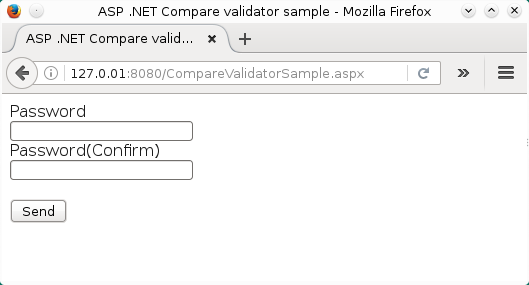
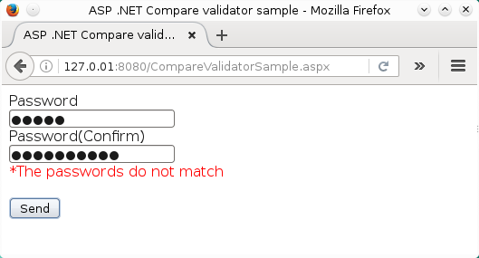
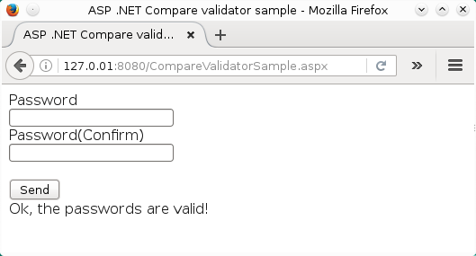

# Usando los controles de validación ASP.NET IV (CompareValidator)
		

			Otra de las tareas muy útiles al construir formularios para aplicaciones <b>ASP.NET</b> es poder comparar el valor de un control en el formulario con el valor de otro control, en estos casos se utiliza el control CompareValidator, este control
			también puede comparar el valor del control con un valor constante o si se requiere asegurarnos que ese valor sea del tipo de datos que nosotros necesitamos.
		

		

		Como primer ejemplo de este control mostraré la una página ASP.NET con unos campos solicitando una contraseña y su confirmación.
		

		

		Este primer ejemplo consta de dos archivos: <b>CompareValidatorSample.aspx</b> y <b>Samples.ASP.CompareValidatorApp.aspx.cs</b>.
		

		
<b>Fig 1 Utilizando el control CompareValidator para confirmar contraseñas.</b>
 
		

		
		
 
		
<b>Fig 2 Si las contraseñas no son idénticas el control muestra un mensaje.</b>
 
		

		
		
 
		
<b>Fig 3 Si las contraseñas coinciden, se envían los datos al servidor.</b>
 
		

		
		

